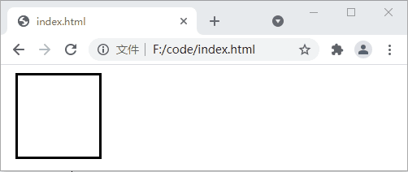
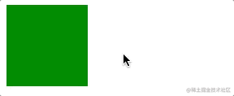

## 前端笔记


### 一 、DOM元素中位置相关属性

```
1、clientWidth：目标元素的width+padding(左右两侧)
2、offsetWidth：目标元素的width+padding(左右两侧)+border(左右两侧)
3、clientLeft：目标元素左边框border的宽度
4、offsetLeft：目标元素左边框离其具有定位的父元素之间的距离
5、clientX：鼠标相对于浏览器窗口可视区域的X坐标（横向）
6、offsetX：鼠标相对于绑定事件元素的X坐标
7、pageX：鼠标相对于文档的X坐标，会计算滚动距离；如果没有滚动距离，值与clientX一样
8、screenX：鼠标相对于显示器屏幕左侧的X坐标
9、getBoundingClientRect().left：目标元素左边框相对于浏览器可视区域的距离，可能为负值
10、scrollWidth：获取指定标签内容层的真实宽度（可视区域宽度+被隐藏区域宽度）。
11、scrollTop 属性可以获取或设置一个元素的内容垂直滚动的像素数。

链接 https://www.bilibili.com/video/BV1pG4y1W7Td/?spm_id_from=333.1007.top_right_bar_window_history.content.click&vd_source=3db4816f451357c6886d30e960368425
```


### 二、transition、transform、animation三个属性的使用与区别详解

+ transition（过渡）

+ transform（变换）

+ animation（动画）

从三个属性就可以知道，tansition是一个过渡属性，就是一个属性从一个值过渡到另一个值，tansform变换，就是一个整体的位置（或整体大小）发生变换，animation动画，就是在一段时间内各种属性进行变化从而达到一个动画的效果。


####  2.1、transition

transition 属性中，transition-property 和 transition-duration 为必填参数，transition-timing-function 和 transition-delay 为选填参数，如非必要可以省略不写。另外，通过 transition 属性也可以设置多组过渡效果，每组之间使用逗号进行分隔，示例代码如下：

```html
<!DOCTYPE html>
<html>
<head>
    <style>
        div {
            width: 100px;
            height: 100px;
            border: 3px solid black;
            margin: 10px 0px 0px 10px;
            transition: width .25s linear 1.9s, background 1s 2s, transform 2s;
        }
        div:hover {
            width: 200px;
            background-color: blue;
            transform: rotate(180deg);
        }
    </style>
</head>
<body>
    <div></div>
</body>
</html>

```



```html
<!DOCTYPE html>
<html lang="en">
<head>
  <title>transition</title>
  <style>
    #box {
      height: 100px;
      width: 100px;
      background: green;
      transition: transform 1s ease-in 1s;
    }

    #box:hover {
      transform: rotate(180deg) scale(.5, .5);
    }
  </style>
</head>
<body>
  <div id="box"></div>
</body>
</html>

```



我们来分析这一整个过程，首先transition给元素设置的过渡属性是transform，当鼠标移入元素时，元素的transform发生变化，那么这个时候就触发了transition，产生了动画，当鼠标移出时，transform又发生变化，这个时候还是会触发transition，产生动画，所以transition产生动画的条件是transition设置的property发生变化，这种动画的特点是需要“一个驱动力去触发”，有着以下几个不足：


1. 需要事件触发，所以没法在网页加载时自动发生
2. 是一次性的，不能重复发生，除非一再触发
3. 只能定义开始状态和结束状态，不能定义中间状态，也就是说只有两个状态

#### 2.2、transform

transform的所有变换都是围绕着x轴,y轴，中心点来进行变换的，

##### 2D变形

| **值**    | **描述**                                               |
| --------- | ------------------------------------------------------ |
| translate | 设置元素在 X轴或者 Y轴上的平移变换                     |
| scale     | 设置元素在 X轴或者 Y轴上的缩放                         |
| rotate    | 二维空间中，rotate即围绕屏幕法向量旋转，等同于 rotateZ |

+ translate位移系列中用于2D的有：`translate`，`translateX`，`translateY`
  设单值表示只X轴位移，Y轴坐标不变

**示例**

```
transform: translate(100px);`等价于`transform: translate(100px,0)`
 `transform: translateY(100px);`等价于`transform: translate(0, 100px);
```

> 上面说了效果类似于`position:relative`属性，但和`position`语义不同，`position`用于页面布局，而`translate`属于`transform`中的一个系列，用于元素变形。你可能觉得语义不同有什么卵用，效果OK不就行了？就看你用什么标准来衡量效果了。CSS的神奇之处在于你可以将一个属性用在完全违背它原意的场景下，抛开代码可读性不谈，违背原意有时还是会有细微差别的。如结合动画效果时，`translate`能小于`1px`过渡，因此动画效果更为平滑。但`position`最小单位就是`1px`，动画效果肯定打折扣。另外用`translate`实现动画时，可以使用`GPU`，动画的`FPS`更高，而`position`显然无法享受这个优势。其他如回流和重绘也都有差异。因此如果你在该用`translate`的地方用了`position`，今后一些需求变动达不到要求，你也没什么立场可抱怨的了。

+ scale缩放

scale缩放系列中用于2D的有：scale，scaleX，scaleY

+ rotate旋转

rotate旋转系列中用于2D的有：rotate

rotate旋转，比较简单，只能设单值。正数表示顺时针旋转，负数表示逆时针旋转。如`transform: rotate(30deg);`

##### 3D变形

| **值**      | 描述   |
| ----------- | ------ |
| translate3d | 3D位移 |
| scale3d     | 3D缩放 |
| rotate3d    | 3D旋转 |

+ translate3d位移

translate3d位移系列中用于3D的有：`translate3d`，`translateZ`

translate3d(tx,ty,tz)，其中tz的Z轴长度只能为px值，不能为%百分比

+ scale3d缩放

scale3d缩放系列中用于3D的有：`scale3d`，`scaleZ`

`scale3d(sx,sy,sz)`，其中sz为Z轴的缩放比例，取值同sx，sy一样，在0.01～0.99时元素缩小，1时大小不变，大于1时元素变大。`scaleZ`等价于`scale(1,1,sz)`。需要注意的是单独使用`scale3d`或`scaleZ`不会有任何效果，需要配合其他属性在3D舞台上才能出现效果，否则Z轴的缩放比例根本无法定义。

+ rotate3d旋转

rotate3d旋转系列中用于3D的有：`rotate3d`，`rotateX`，`rotateY`，`rotateZ`

`rotate3d(x,y,z,a)`这里多了一个参数a（读音是阿尔法…）表示3D舞台上旋转的角度，而xyz的取值为0～1为各轴的旋转矢量值。

#### 2.3、animation

```
.element {
  animation: pulse 5s infinite;
}

@keyframes pulse {
  0% {
    background-color: #001F3F;
  }
  100% {
    background-color: #FF4136;
  }
}
```

### 三、flex布局

#### 3.1 基本概念

​		采用 Flex 布局的元素，称为 Flex 容器（flex container），简称"容器"。它的所有子元素自动成为容器成员，称为 Flex 项目（flex item），简称"项目"。


​		容器默认存在两根轴：水平的主轴（main axis）和垂直的交叉轴（cross axis）。主轴的开始位置（与边框的交叉点）叫做`main start`，结束位置叫做`main end`；交叉轴的开始位置叫做`cross start`，结束位置叫做`cross end`。

​		项目默认沿主轴排列。单个项目占据的主轴空间叫做`main size`，占据的交叉轴空间叫做`cross size`。

#### 3.2、容器的属性

以下6个属性设置在容器上。

> - flex-direction
> - flex-wrap
> - flex-flow
> - justify-content
> - align-items
> - align-content

##### 3.2.1 flex-direction属性

`flex-direction`属性决定主轴的方向（即项目的排列方向）。

```css
.box {
  flex-direction: row | row-reverse | column | column-reverse;
}
```


它可能有4个值。

> - `row`（默认值）：主轴为水平方向，起点在左端。
> - `row-reverse`：主轴为水平方向，起点在右端。
> - `column`：主轴为垂直方向，起点在上沿。
> - `column-reverse`：主轴为垂直方向，起点在下沿。

##### 3.2.2 flex-wrap属性

默认情况下，项目都排在一条线（又称"轴线"）上。`flex-wrap`属性定义，如果一条轴线排不下，如何换行。


