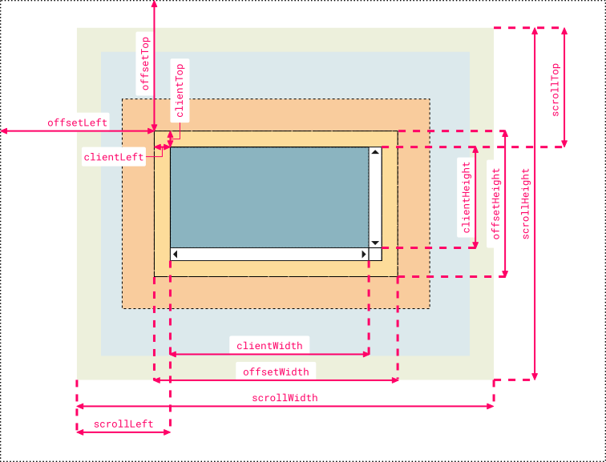

## 前端笔记


### DOM元素中位置相关属性

```
1、clientWidth：目标元素的width+padding(左右两侧)
2、offsetWidth：目标元素的width+padding(左右两侧)+border(左右两侧)
3、clientLeft：目标元素左边框border的宽度
4、offsetLeft：目标元素左边框离其具有定位的父元素之间的距离
5、clientX：鼠标相对于浏览器窗口可视区域的X坐标（横向）
6、offsetX：鼠标相对于绑定事件元素的X坐标
7、pageX：鼠标相对于文档的X坐标，会计算滚动距离；如果没有滚动距离，值与clientX一样
8、screenX：鼠标相对于显示器屏幕左侧的X坐标
9、getBoundingClientRect().left：目标元素左边框相对于浏览器可视区域的距离，可能为负值
10、scrollWidth：获取指定标签内容层的真实宽度（可视区域宽度+被隐藏区域宽度）。
11、scrollTop 属性可以获取或设置一个元素的内容垂直滚动的像素数。

链接 https://www.bilibili.com/video/BV1pG4y1W7Td/?spm_id_from=333.1007.top_right_bar_window_history.content.click&vd_source=3db4816f451357c6886d30e960368425
```


